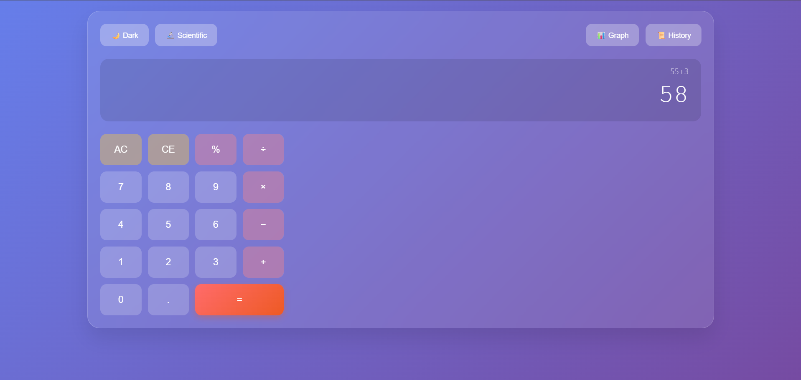
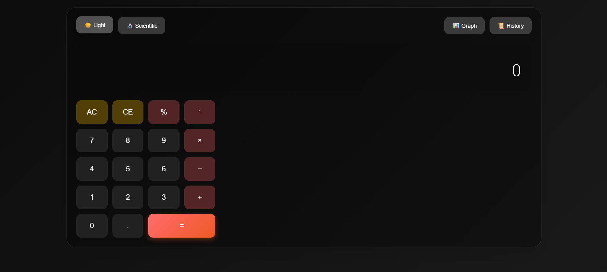
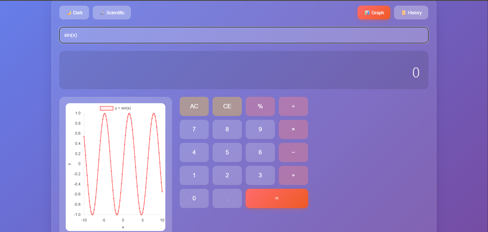

# 🧮 Modern Scientific Calculator

A sleek, feature-rich calculator built with modern web technologies, featuring glassmorphism design, scientific functions, and interactive graphing capabilities.

## 🚀 [Live Demo](https://A-Jayaprakash.github.io/modern-calculator)



## ✨ Features

### 🎨 Modern UI/UX
- **Glassmorphism Design** - Beautiful blur effects and transparency
- **Dark/Light Theme** - Toggle between themes with smooth transitions
- **Responsive Layout** - Works seamlessly on desktop, tablet, and mobile
- **Smooth Animations** - Button press effects and transitions

### 🔢 Calculator Modes
- **Basic Mode** - Standard arithmetic operations
- **Scientific Mode** - Advanced mathematical functions (sin, cos, tan, log, ln, etc.)
- **Memory Functions** - Store and recall calculations
- **Keyboard Support** - Full keyboard navigation and input

### 📊 Advanced Features
- **Interactive Graphing** - Plot mathematical functions with Chart.js
- **Calculation History** - View and reuse previous calculations
- **Error Handling** - Graceful error messages and recovery
- **Expression Parsing** - Support for complex mathematical expressions

## 🛠️ Built With

- **HTML5** - Semantic markup and structure
- **CSS3** - Modern styling with Grid, Flexbox, and animations
- **Vanilla JavaScript** - ES6+ features and DOM manipulation
- **Math.js** - Mathematical expression parsing and evaluation
- **Chart.js** - Interactive graph rendering

## 🎯 Key Technical Highlights

- **Responsive Design** - CSS Grid and Flexbox for adaptive layouts
- **Modern CSS** - Custom properties, backdrop-filter, and smooth animations
- **Event-Driven Architecture** - Efficient event handling and state management
- **Mathematical Parsing** - Robust expression evaluation with error handling
- **Performance Optimized** - Minimal DOM manipulation and efficient rendering

## 📱 Screenshots

<div align="center">

### Light Theme


### Dark Theme  


### Graphing Feature


</div>

## 🚀 Getting Started

### Prerequisites
- Modern web browser (Chrome, Firefox, Safari, Edge)
- No additional dependencies required!

### Installation

1. **Clone the repository**
   ```bash
   git clone https://github.com/yourusername/modern-calculator.git
   cd modern-calculator
   ```

2. **Open in browser**
   ```bash
   # Simply open index.html in your browser
   open index.html
   
   # Or serve with a local server
   python -m http.server 8000
   # Navigate to http://localhost:8000
   ```

3. **Start calculating!** 🎉

## 💡 Usage Examples

### Basic Calculations
```
2 + 3 × 4 = 14
(15 + 25) ÷ 8 = 5
```

### Scientific Functions
```
sin(π/2) = 1
log(100) = 2
√(64) = 8
```

### Graphing
```
Enter equations like:
- x^2 (parabola)
- sin(x) (sine wave)  
- log(x) (logarithmic curve)
```

## 🎨 Design Philosophy

This calculator embraces modern web design principles:
- **Glassmorphism** for depth and visual interest
- **Minimalist Interface** reducing cognitive load
- **Intuitive Interactions** with clear visual feedback
- **Accessibility First** with proper contrast and navigation

## 🚧 Future Enhancements

- [ ] **Unit Conversions** - Length, weight, temperature, etc.
- [ ] **Equation Solver** - Solve algebraic equations
- [ ] **Matrix Operations** - Linear algebra calculations
- [ ] **Statistics Mode** - Mean, median, standard deviation
- [ ] **Programmable Functions** - User-defined functions
- [ ] **Export/Import** - Save calculations and settings
- [ ] **Voice Input** - Calculate by speaking
- [ ] **3D Graphing** - Plot functions in three dimensions

## 🤝 Contributing

Contributions are welcome! Please feel free to submit a Pull Request. For major changes, please open an issue first to discuss what you would like to change.

1. Fork the Project
2. Create your Feature Branch (`git checkout -b feature/AmazingFeature`)
3. Commit your Changes (`git commit -m 'Add some AmazingFeature'`)
4. Push to the Branch (`git push origin feature/AmazingFeature`)
5. Open a Pull Request

## 📝 License

This project is licensed under the MIT License - see the [LICENSE](LICENSE) file for details.

## 🙏 Acknowledgments

- **Math.js** - For powerful mathematical expression parsing
- **Chart.js** - For beautiful and interactive charts
- **Design Inspiration** - Modern calculator apps and glassmorphism trend
- **Community** - Stack Overflow and developer communities for guidance

## 👨‍💻 Author

**Your Name**
- GitHub: [@A-Jayaprakash](https://github.com/A-Jayaprakash)
- LinkedIn: [Jayaprakash A](https://linkedin.com/in/jayaprakashoffic)

---

<div align="center">

**If you found this project helpful, please give it a ⭐!**

Made with ❤️ and lots of ☕

</div>
